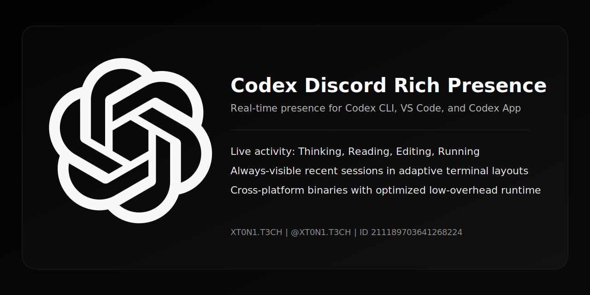

# Codex Discord Rich Presence

<p align="center">
  
</p>

<p align="center">
  <a href="https://github.com/xt0n1-t3ch/Codex-Discord-Rich-Presence/actions/workflows/ci.yml"></a>
  <a href="https://github.com/xt0n1-t3ch/Codex-Discord-Rich-Presence/releases"></a>
  <a href="LICENSE"></a>
  
  
</p>

<p align="center"><strong>Minimal, real-time Discord Rich Presence for Codex CLI, VS Code, and Codex App.</strong></p>

## About

GitHub About text (copy/paste):

`Real-time Discord Rich Presence for Codex. Auto-detects CLI/VS Code vs Codex App and switches branding, client ID, and assets accordingly.`

Suggested GitHub topics:

`codex` `codex-app` `codex-cli` `vscode` `discord` `rich-presence` `rust` `desktop`

## Why this project

`codex-discord-presence` is a low-overhead Rust runtime that reads local Codex session JSONL files, detects live coding activity, and publishes clean Discord presence updates with stable idle behavior.

It is designed for:

- Codex CLI users
- VS Code Codex workflows
- Codex App (Desktop) users on Windows, Linux, and macOS

## Key Features

- Automatic surface detection from `session_meta` (`originator`/`source`):
  - CLI/VS Code -> `Codex` Discord app profile
  - Codex App (Desktop) -> `Codex App` profile (dedicated client ID and artwork)
- Real-time activity classification (`Thinking`, `Reading`, `Editing`, `Running`, `Waiting for input`)
- Minimal, readable Discord card text with deterministic truncation
- Stable multi-session ranking with anti-false-idle logic
- Global-first 5h/7d limits selection (`limit_id=codex` preference)
- Auto plan label detection from telemetry (`free`, `plus`, `pro`, etc.) with cache fallback
- Per-model tokens/cost metrics persisted to JSON + Markdown
- Adaptive TUI refresh and deduplicated Discord updates for low CPU usage
- Dynamic Discord client switching when session surface changes

## Quick Start

1. Create Discord assets:
   - CLI/VS Code app: main logo (`codex-logo`) + small icon (`openai`)
   - Codex App desktop app: desktop logo (`codex-app`) + small icon (`openai`)
2. Build binary:
   - Windows: `./scripts/build-release.ps1`
   - Linux/macOS: `./scripts/build-release.sh`
3. Run:
   - `codex-discord-presence`
4. Optional diagnostics:
   - `codex-discord-presence status`
   - `codex-discord-presence doctor`

## Install and Releases

Build from source:

```bash
cargo build --release
```

Release binaries:

- [GitHub Releases](https://github.com/xt0n1-t3ch/Codex-Discord-Rich-Presence/releases)
- Output layout:
  - `releases/windows/codex-discord-rich-presence.exe`
  - `releases/linux/codex-discord-rich-presence`
  - `releases/macos/codex-discord-rich-presence`

Windows executable branding:

- `.exe` icon is embedded from `assets/branding/codex-app.png` during build.

## Commands

```bash
codex-discord-presence
codex-discord-presence codex [args...]
codex-discord-presence status
codex-discord-presence doctor
```

## Configuration

Config file:

- `~/.codex/discord-presence-config.json`

Important defaults:

- `schema_version`: `7`
- `discord_client_id`: `1470480085453770854`
- `discord_client_id_desktop`: `1478395304624652345`
- `display.large_image_key`: `codex-logo`
- `display.desktop_large_image_key`: `codex-app`
- `display.desktop_large_text`: `Codex App`
- `display.small_image_key`: `openai`
- `privacy.show_cost`: `true`
- `openai_plan.show_price`: `true`
- `poll_interval_seconds`: `2`

Environment overrides:

- `CODEX_DISCORD_CLIENT_ID`
- `CODEX_DISCORD_CLIENT_ID_DESKTOP`
- `CODEX_PRESENCE_STALE_SECONDS`
- `CODEX_PRESENCE_POLL_SECONDS`
- `CODEX_PRESENCE_ACTIVE_STICKY_SECONDS`
- `CODEX_HOME`

## Surface Detection (CLI/VS Code vs Codex App)

- Desktop mode is detected when `session_meta.originator` contains `desktop`.
- Fallback: if `session_meta.source` contains `desktop`, desktop mode is used.
- Otherwise the runtime uses CLI/VS Code mode.
- Idle state preserves the last active surface, so branding stays consistent.

## Performance Profile

- Rust native binary (no Electron runtime)
- Release profile: `lto=thin`, `panic=abort`, `strip=true`, single codegen unit
- Adaptive terminal event polling to minimize idle CPU usage
- Presence publish dedupe + heartbeat/reconnect strategy

## Docs

- [docs/README.md](docs/README.md)
- [docs/api/codex-presence.md](docs/api/codex-presence.md)
- [docs/database/schema.md](docs/database/schema.md)
- [docs/ui/UI_SITEMAP.md](docs/ui/UI_SITEMAP.md)

## Credits

<p align="center">
  
</p>

## OpenAI Brand Notice

- OpenAI marks and logos are trademarks of OpenAI.
- Follow official guidelines when distributing or configuring assets:
  - https://openai.com/brand/

## Security and Privacy

- Reads local Codex session files only
- No external telemetry pipeline
- See `PRIVACY.md` and `SECURITY.md`

## License

MIT (`LICENSE`)
